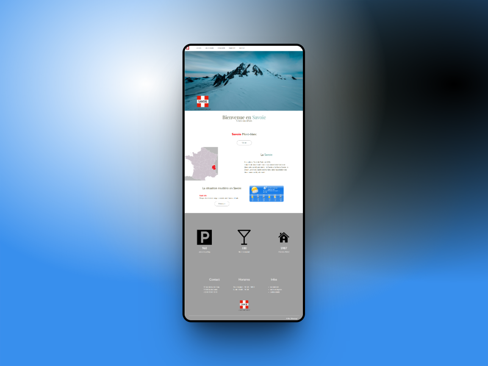
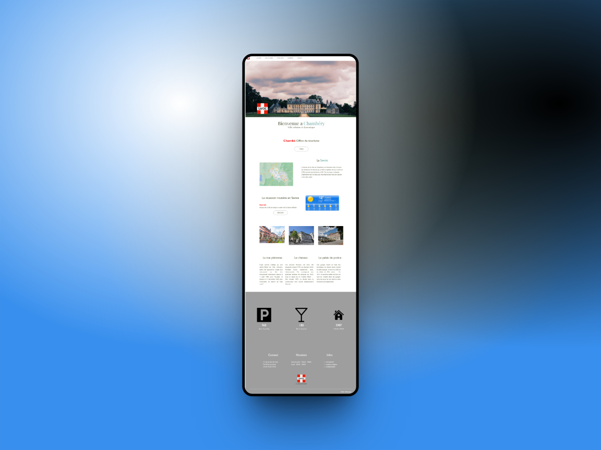
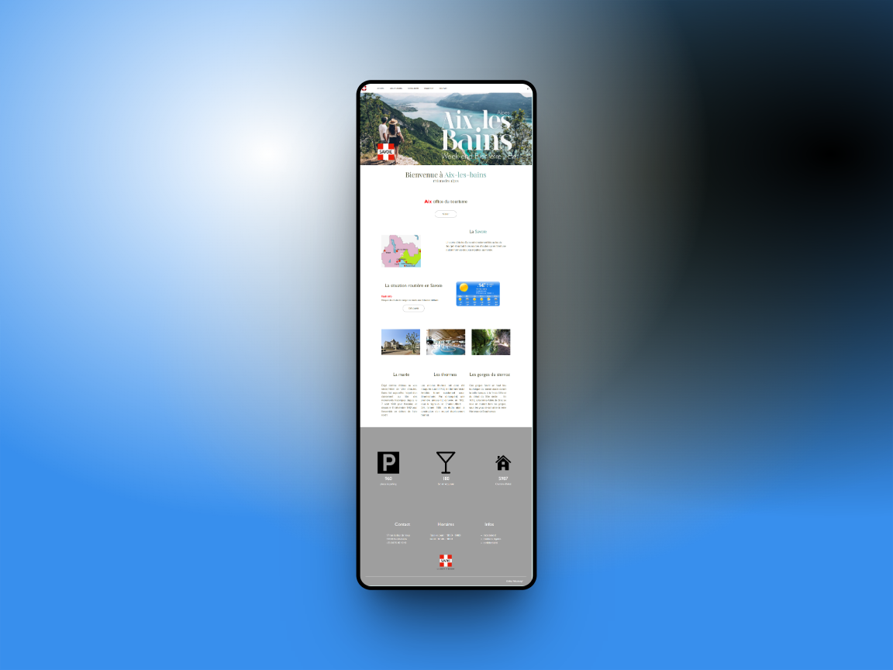

  

        <h2> Création d'un site HTML | CSS ! 🛸</h2>

  

  
        <h2>💻 Programming 🔝</h2>  
        

  
        <h2>👨‍🎨 Customing 🔝</h2>  
        

        
        
        
        

  

  

